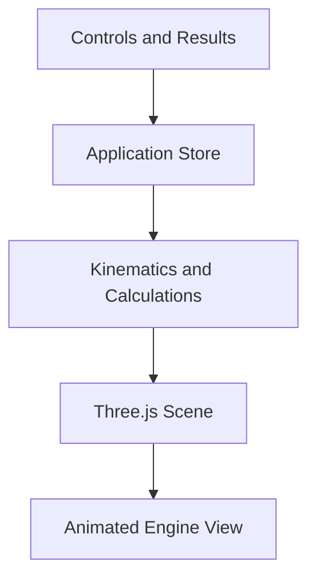

# Engine Visualizer — Technical Design Document

**Status:** Draft  
**Version:** 0.1  
**Date:** August 30, 2026  
**Initial milestone:** Single-cylinder slider-crank visualizer

---

## 1. Purpose

Engine Visualizer is an interactive web application for exploring piston-engine geometry and motion.

Users will be able to enter engine dimensions, animate the crank mechanism, and observe how parameters such as bore, stroke, connecting-rod length, and engine speed affect piston movement.

The initial release will model one cylinder using a mechanically accurate slider-crank calculation. Later releases will expand the same simulation and rendering architecture to inline, V, and flat multi-cylinder engines.

The project is also intended to provide practical experience with:

- TypeScript and React
- Component-based application design
- Separating simulation logic from presentation
- Three-dimensional rendering
- Animation loops
- Automated testing
- Incremental project planning

---

## 2. Product Goals

### 2.1 Initial goals

The first working version must:

- Display one piston, connecting rod, crankpin, and crankshaft center.
- Animate the mechanism smoothly.
- Use slider-crank geometry rather than approximate sinusoidal piston motion.
- Allow the user to change:
  - Bore
  - Stroke
  - Connecting-rod length
  - Engine speed
  - Crank angle
  - Display units
- Allow animation to be played and paused.
- Allow the crank angle to be manually scrubbed.
- Display useful calculated values.
- Keep simulation calculations separate from rendering code.
- Include automated tests for the mechanical calculations.

### 2.2 Long-term goals

Future versions may support:

- Inline engines
- V engines
- Flat or boxer engines
- Engine layout presets
- Custom crankshaft phasing
- Firing orders
- Four-stroke cycle visualization
- Cylinder heads and valves
- Combustion and ignition indicators
- Camera rotation
- CAD-like component models
- Section and exploded views
- Shareable engine configurations

These capabilities influence the architecture, but they are not part of the initial milestone.

---

## 3. Non-Goals for the Initial Release

Version 1 will not include:

- Multiple cylinders
- V-angle configuration
- Firing-order simulation
- Intake, compression, power, or exhaust cycles
- Valves or camshafts
- Realistic combustion physics
- Engine sound
- User accounts
- Cloud storage
- A backend server
- Importing or exporting configurations
- Photorealistic engine components
- True CAD modeling or manufacturing output
- Structural, thermal, or stress analysis

The first release is a kinematic visualization tool, not an engine-design or engineering-validation system.

---

## 4. Target User Experience

When the application opens, the user should immediately see:

- The engine mechanism
- The primary geometry controls
- Play and pause controls
- Current calculated results

The visualization is the main working surface. It should not be preceded by a marketing-style landing page.

### 4.1 Primary workflow

1. The user opens the application.
2. A default single-cylinder engine is displayed.
3. The animation begins at a moderate RPM.
4. The user pauses the animation.
5. The user changes bore, stroke, or rod length.
6. The rendered mechanism updates immediately.
7. The user drags the crank-angle control to inspect the mechanism.
8. The user resumes the animation.
9. Calculated values update to match the current configuration.

### 4.2 Desktop layout

The desktop interface will use two main regions:

- A control and results panel
- A larger visualization viewport

### 4.3 Mobile layout

On smaller screens:

- The visualization appears first.
- Controls appear below it.
- Inputs remain large enough for touch interaction.
- The page avoids horizontal scrolling.

---

## 5. Technology Decisions

| Area                        | Technology            | Reason                                                                 |
| --------------------------- | --------------------- | ---------------------------------------------------------------------- |
| Language                    | TypeScript            | Provides type safety for geometry, configuration, and component APIs   |
| UI framework                | React                 | Suitable for interactive controls and component-based organization     |
| Build tool                  | Vite                  | Lightweight, fast, and appropriate for a client-only application       |
| Rendering                   | Three.js              | Supports the planned progression from flat cutaway graphics to full 3D |
| React rendering integration | React Three Fiber     | Allows Three.js objects to be expressed as React components            |
| Three.js helpers            | Drei                  | Provides useful camera, line, text, and scene utilities                |
| Application state           | Zustand               | Provides a small shared store without excessive boilerplate            |
| Input validation            | Zod                   | Defines and validates acceptable engine configurations                 |
| Unit testing                | Vitest                | Integrates well with Vite and TypeScript                               |
| Component testing           | React Testing Library | Tests user-visible control behavior                                    |
| Styling                     | CSS Modules           | Keeps styling local without adding a larger UI framework               |
| Formatting                  | Prettier              | Provides consistent formatting                                         |
| Static analysis             | oxlint                | Ships with the current Vite template; fast, ESLint-compatible rule set |
| Hosting                     | Vercel                | Git-linked auto-deploys with previews for a client-only portfolio demo |
| CI                          | GitHub Actions        | Runs lint, format check, tests, and production build on every push     |

> **Amendment (2026-08-30):** The Vite template now ships oxlint rather than ESLint, along with Vite 8, TypeScript 6, and React 19.2. React Three Fiber v9 requires React 19, so these versions are compatible. The original draft named ESLint; oxlint is used instead.

### 5.1 Why Vite instead of Next.js?

The initial application:

- Runs entirely in the browser.
- Does not require server-side rendering.
- Does not require API routes.
- Does not require authentication or persistent server data.

Vite provides the required development and production tooling with less framework overhead.

### 5.2 Why Three.js instead of SVG or Canvas 2D?

The first visualization will resemble a flat mechanical cutaway, but its components will exist in a Three.js scene.

This allows later versions to add:

- Component depth
- Perspective
- Camera rotation
- Lighting
- Materials
- Detailed component models

Starting with Three.js avoids replacing a temporary 2D renderer later.

### 5.3 Why not use a CAD kernel?

A CAD kernel such as OpenCascade would add substantial complexity without helping the initial goal.

Three.js can provide a convincing CAD-like visual style while remaining suitable for interactive browser animation. True CAD operations will only be considered if later requirements justify them.

---

## 6. High-Level Architecture



The application will be divided into four primary layers:

1. **Interface layer**  
   Displays controls, calculated values, and validation messages.

2. **State layer**  
   Stores the engine configuration and user-controlled animation state.

3. **Simulation layer**  
   Contains pure mathematical functions for engine geometry and calculated results.

4. **Rendering layer**  
   Converts simulation results into visible Three.js component positions and rotations.

The rendering layer must not contain the authoritative mechanical calculations.

---

## 7. State Design

State will be divided into configuration state and runtime animation state.

### 7.1 Configuration state

```ts
interface CrankMechanismConfig {
  boreMm: number;
  strokeMm: number;
  rodLengthMm: number;
  compressionRatio: number;
}
```

All engine dimensions will be stored internally in millimeters.

> **Amendment (2026-08-30):** `compressionRatio` (dimensionless, validated 5–20:1) was added to the configuration. The clearance volume is modeled as a flat cylindrical disc above the piston crown at TDC — chamber domes, piston dishes, and gasket volume are not modeled — giving a clearance height of `strokeMm / (compressionRatio − 1)`. The rendered cylinder head sits exactly this height above the TDC crown, and the results panel shows clearance volume and clearance height. The application also ships preset per-cylinder geometries for well-known sports-car engines (`src/engine/presets.ts`), each with bore, stroke, rod length, and stock compression ratio corroborated by at least two independent sources.

### 7.2 User preferences

```ts
type DisplayUnit = "mm" | "in";

interface UserPreferences {
  displayUnit: DisplayUnit;
  showLabels: boolean;
}
```

Changing display units must not alter the underlying engine dimensions.

### 7.3 Animation controls

```ts
interface AnimationControls {
  rpm: number;
  isPlaying: boolean;
  crankAngleRad: number;
}
```

The global store will hold user-controlled animation values, but it should not be updated unnecessarily on every rendered frame.

The live animation loop will use local references where possible. This prevents the entire React interface from rerendering 60 times per second.

**Amendment (2026-08-30) — playback speed and comparison:** Animation state also carries a visual `playbackSpeed` multiplier (1× to 1/50×, default 1/10×) because realistic engine speeds strobe at display frame rates; readouts always use true RPM. The store additionally holds an optional `comparisonConfig` (engine B) that shares rpm, playback state, and crank angle with engine A and is rendered beside it at the same millimeter scale.

**Live readout throttling:** The results panel and the crank-angle slider display values that change every frame while playing (crank angle, piston displacement, rod angle). These readouts must be driven by a throttled store sync (roughly 10 updates per second is sufficient for legibility) rather than per-frame state updates. When playback is paused or the user scrubs, the displayed values update immediately and exactly.

---

## 8. Units and Coordinate System

### 8.1 Canonical units

The application will use:

- Millimeters for length
- Radians for internal angles
- Revolutions per minute for engine speed
- Cubic centimeters for displayed displacement
- Meters per second for mean piston speed

Unit conversion will occur only at the user-interface boundary.

### 8.2 Scene coordinate system

For the initial upright cylinder:

- The crankshaft center is the origin.
- The positive Y-axis follows the cylinder centerline toward the cylinder head.
- The X-axis represents lateral crankpin movement.
- The Z-axis represents crankshaft depth.
- Crank angle `0` represents top dead center.

This convention must be documented in the math code and used consistently by every rendered component.

---

## 9. Slider-Crank Mathematics

### 9.1 Definitions

Let:

- \(s\) = stroke
- \(r = s/2\) = crank radius
- \(l\) = connecting-rod center-to-center length
- \(\theta\) = crank angle
- \(x_c\) = crankpin horizontal position
- \(y_c\) = crankpin vertical position
- \(y_p\) = piston-pin vertical position

### 9.2 Crankpin position

\[
x_c = r\sin(\theta)
\]

\[
y_c = r\cos(\theta)
\]

### 9.3 Piston-pin position

Because the piston pin remains on the cylinder centerline:

\[
y_p =
r\cos(\theta) +
\sqrt{l^2-r^2\sin^2(\theta)}
\]

At top dead center:

\[
y_{TDC} = r+l
\]

At bottom dead center:

\[
y_{BDC} = l-r
\]

### 9.4 Piston displacement from top dead center

\[
d =
(r+l)-y_p
\]

Expected behavior:

- At \(0^\circ\), displacement is `0`.
- At \(180^\circ\), displacement equals the stroke.
- At \(360^\circ\), displacement returns to `0`.

### 9.5 Connecting-rod angle

The rod angle relative to the cylinder centerline is:

\[
\phi =
\arcsin\left(\frac{r}{l}\sin(\theta)\right)
\]

The rendered rod may instead use the crankpin and piston-pin coordinates to calculate its midpoint, length, and rotation. Both approaches must produce equivalent results.

**Sign convention:** `arcsin` returns a signed angle. A positive rod angle means the big end (crankpin) has swung toward positive X, tilting the rod clockwise when viewed from the front of the scene. The kinematics module must document and test this convention so rendering code applies rotation in the correct direction.

### 9.6 Engine displacement

For one cylinder:

\[
V =
\frac{\pi}{4}b^2s
\]

Where \(b\) is bore.

When bore and stroke are measured in millimeters:

\[
V_{cc} =
\frac{\pi b^2s}{4000}
\]

### 9.7 Rod-to-stroke ratio

\[
R =
\frac{l}{s}
\]

### 9.8 Mean piston speed

\[
v_m =
\frac{2s \times RPM}{60}
\]

Stroke must be converted from millimeters to meters before displaying the result in meters per second.

---

## 10. Simulation API

The simulation layer will expose pure functions similar to:

```ts
interface MechanismState {
  crankAngleRad: number;
  crankPinXmm: number;
  crankPinYmm: number;
  pistonPinYmm: number;
  pistonDisplacementMm: number;
  rodAngleRad: number;
}

function calculateMechanismState(
  config: CrankMechanismConfig,
  crankAngleRad: number,
): MechanismState;
```

Additional calculation functions will include:

```ts
function calculateCylinderDisplacementCc(
  boreMm: number,
  strokeMm: number,
): number;

function calculateMeanPistonSpeedMps(strokeMm: number, rpm: number): number;

function calculateRodStrokeRatio(rodLengthMm: number, strokeMm: number): number;
```

These functions must not import React, Three.js, Zustand, or browser APIs.

---

## 11. Animation Design

React Three Fiber’s frame loop will drive the animation.

For each frame:

\[
\Delta\theta =
\Delta t
\times
RPM
\times
\frac{2\pi}{60}
\]

The new angle is:

\[
\theta_{new} =
(\theta_{old}+\Delta\theta)\bmod 2\pi
\]

### 11.1 Animation rules

- Pausing freezes the current crank angle.
- Scrubbing sets the crank angle directly.
- Beginning a scrub pauses playback.
- Pressing play resumes from the selected angle.
- Changing RPM takes effect without resetting the angle.
- Changing engine geometry takes effect without restarting playback.
- Large frame-time jumps will be clamped to prevent the mechanism from visibly jumping after the browser tab has been inactive.
- The animation loop must avoid creating unnecessary temporary objects each frame.

The initial piston animation repeats every crankshaft revolution. Four-stroke cycle state will later use a 720-degree cycle, but that is outside the first milestone.

---

## 12. Rendering Design

The scene will use:

- An orthographic camera
- A fixed cutaway-style viewpoint
- Simple extruded geometry
- Subtle lighting and shadows
- Visible component outlines
- A dark technical background
- Neutral metallic components
- A contrasting highlight color for moving joints

### 12.1 Initial scene components

#### Cylinder guide

Shows the bore and the path along which the piston travels.

#### Piston

A simplified cylindrical or rectangular-section piston sized relative to the bore.

#### Piston pin

Marks the connection between the piston and connecting rod.

#### Connecting rod

Extends between the piston pin and crankpin.

#### Crankpin

Shows the rotating connection between the crank and rod.

#### Crank throw

Connects the crankshaft center to the crankpin.

#### Crankshaft center

Provides a fixed reference for rotation.

#### Reference indicators

May include:

- Cylinder centerline
- Top dead center marker
- Bottom dead center marker
- Crank rotation direction

### 12.2 Geometry scaling

The engine will use its real relative proportions, but the camera will automatically frame the complete mechanism.

The application must not distort bore, stroke, or rod length independently just to fill the viewport.

---

## 13. Input Validation

The configuration schema will reject or prevent:

- A bore less than or equal to zero
- A stroke less than or equal to zero
- A connecting-rod length less than or equal to the crank radius
- Negative RPM
- Non-numeric values
- Infinite values
- Values that would produce invalid geometry

Initial practical input ranges:

| Input       | Minimum | Maximum |
| ----------- | ------: | ------: |
| Bore        |   20 mm |  200 mm |
| Stroke      |   20 mm |  200 mm |
| Rod length  |   30 mm |  400 mm |
| RPM         |       0 |  12,000 |
| Crank angle |      0° |    360° |

> **Amendment (2026-08-30):** Two later configuration fields follow the same pattern: compression ratio validates at 5–20:1 and redline at 3,000–12,000 rpm. The running-speed maximum was raised from 10,000 to 12,000 so that every redline the validator accepts is also an acceptable running speed — the "At redline" control depends on that.

The mathematical validation rule `rodLength > stroke / 2` remains authoritative even when values fall within their individual ranges.

Validation messages should explain the problem in mechanical terms. For example:

> Connecting-rod length must be greater than the 43 mm crank radius.

Invalid values must not be passed into the simulation or renderer.

---

## 14. Default Configuration

The application will begin with a plausible automotive single-cylinder configuration:

```ts
const DEFAULT_CONFIG: CrankMechanismConfig = {
  boreMm: 86,
  strokeMm: 86,
  rodLengthMm: 143,
  compressionRatio: 10.5,
};
```

Default animation settings:

```ts
const DEFAULT_ANIMATION = {
  rpm: 600,
  isPlaying: true,
  crankAngleRad: 0,
};
```

These values produce a square bore-to-stroke relationship and visually understandable motion.

**Reduced motion:** If the user's system reports `prefers-reduced-motion: reduce`, the application starts paused at the default crank angle instead of auto-playing. All other behavior is unchanged.

---

## 15. Calculated Results

The initial results panel will display:

- Cylinder displacement in cubic centimeters
- Bore-to-stroke ratio
- Rod-to-stroke ratio
- Mean piston speed
- Current crank angle
- Current piston displacement from top dead center
- Current connecting-rod angle

Displayed values will be rounded for readability, while calculations retain full JavaScript numeric precision.

---

## 16. Proposed Project Structure

```text
engine-visualizer/
├── src/
│   ├── app/
│   │   └── App.tsx
│   ├── components/
│   │   ├── controls/
│   │   │   ├── AnimationControls.tsx
│   │   │   ├── EngineGeometryControls.tsx
│   │   │   └── UnitSelector.tsx
│   │   ├── results/
│   │   │   └── CalculationPanel.tsx
│   │   └── layout/
│   │       └── ApplicationShell.tsx
│   ├── engine/
│   │   ├── calculations.ts
│   │   ├── constants.ts
│   │   ├── kinematics.ts
│   │   ├── types.ts
│   │   ├── units.ts
│   │   └── validation.ts
│   ├── scene/
│   │   ├── EngineScene.tsx
│   │   ├── SingleCylinderMechanism.tsx
│   │   ├── Piston.tsx
│   │   ├── ConnectingRod.tsx
│   │   ├── CrankThrow.tsx
│   │   ├── CylinderGuide.tsx
│   │   └── SceneLighting.tsx
│   ├── state/
│   │   └── engineStore.ts
│   ├── styles/
│   │   └── globals.css
│   ├── tests/
│   │   ├── calculations.test.ts
│   │   ├── kinematics.test.ts
│   │   ├── units.test.ts
│   │   └── validation.test.ts
│   └── main.tsx
├── public/
├── TECHNICAL_DESIGN.md
├── README.md
├── package.json
├── tsconfig.json
└── vite.config.ts
```

Files may be reorganized if implementation reveals a clearer boundary, but simulation code and rendering code must remain separate.

---

## 17. Testing Strategy

### 17.1 Kinematics tests

Tests will verify known crank positions:

#### Top dead center

At `0°`:

- Crankpin X equals `0`.
- Piston displacement equals `0`.
- Rod angle equals `0`.

#### Mid-stroke region

At `90°`:

- Crankpin X equals the crank radius.
- Piston position matches the slider-crank formula.
- The result demonstrates the effect of rod angularity.

#### Bottom dead center

At `180°`:

- Crankpin X equals `0`.
- Piston displacement equals the stroke.
- Rod angle equals `0`.

#### Full revolution

At `360°`:

- The mechanism returns to its `0°` position.

### 17.2 Invariant tests

Across a range of crank angles:

- Calculated values remain finite.
- Piston displacement remains between zero and the stroke.
- The distance between the crankpin and piston pin remains equal to rod length within floating-point tolerance.
- Equivalent angles produce equivalent positions.
- The square-root calculation never receives an invalid value for a valid configuration.

### 17.3 Calculation tests

Tests will verify:

- Cylinder displacement
- Mean piston speed
- Rod-to-stroke ratio
- Bore-to-stroke ratio
- Millimeter-to-inch conversion
- Inch-to-millimeter conversion

### 17.4 Validation tests

Tests will verify acceptance and rejection of:

- Valid configurations
- Zero and negative dimensions
- Rods shorter than the crank radius
- Non-finite values
- Out-of-range RPM values

### 17.5 Interface tests

Basic component tests will verify:

- Changing an input updates the configuration.
- Changing units preserves the physical dimensions.
- Play and pause controls update animation state.
- Scrubbing changes crank angle and pauses playback.
- Validation errors are visible and understandable.

---

## 18. Performance Requirements

The initial performance targets are:

- Smooth animation near 60 frames per second on a typical desktop computer
- Responsive controls during animation
- No global React state update on every animation frame
- No unnecessary rebuilding of static Three.js geometry
- No visible pause when dimensions change
- Initial production JavaScript kept reasonably small for a Three.js application

Development builds may run more slowly than production builds.

---

## 19. Accessibility Requirements

The interface will:

- Use semantic labels for every control.
- Support keyboard operation.
- Display values as text rather than relying only on graphics.
- Avoid using color as the only way to communicate state.
- Provide visible keyboard focus indicators.
- Maintain readable contrast.
- Respect reduced-motion preferences by starting paused or reducing automatic motion when appropriate.
- Provide a textual description of the current mechanism state.

The 3D canvas itself will not be the only source of important information.

> **Amendment (2026-08-30):** The textual mechanism state is provided by the calculated-results panel and comparison table, where every live value — crank angle, piston displacement from top dead center, connecting-rod angle — is a labeled row with proper `dl`/`table` semantics. A prose sentence restating those same values was removed: it duplicated the rows, and reflowing it on every readout update made the layout jump during playback. Structured rows serve assistive technology better than the paragraph did, so this requirement remains satisfied.

---

## 20. Error Handling

Expected errors will be handled inside the interface.

Examples include:

- Invalid numeric input
- Impossible connecting-rod geometry
- WebGL initialization failure
- Rendering failure

If WebGL is unavailable, the application should show a useful message instead of a blank viewport.

Unexpected rendering errors should be contained with a React error boundary.

---

## 21. Implementation Phases

### Phase 1 — Project foundation

- Create the Vite React TypeScript project.
- Configure linting, formatting, and tests.
- Create the planned directory structure.
- Add the initial types and default configuration.
- Confirm the application builds.

### Phase 2 — Mechanical calculations

- Implement unit conversions.
- Implement displacement calculations.
- Implement slider-crank kinematics.
- Implement validation.
- Write and pass unit tests.

No visualization work should be considered authoritative until the math tests pass.

### Phase 3 — Static engine scene

- Create the orthographic scene.
- Add the cylinder guide.
- Add the piston.
- Add the connecting rod.
- Add the crank throw and joints.
- Render a selected static crank angle.

### Phase 4 — Animation

- Add frame-based crank rotation.
- Add play and pause behavior.
- Add RPM control.
- Add crank-angle scrubbing.
- Prevent unnecessary React rerenders.

### Phase 5 — Interface and calculated results

- Add geometry controls.
- Add unit selection.
- Add validation messages.
- Add calculated outputs.
- Add responsive layout and accessibility behavior.

### Phase 6 — Initial release validation

- Run all automated tests.
- Run the production build.
- Check desktop and mobile layouts.
- Verify extreme valid configurations.
- Update the README.
- Record known limitations.

---

## 22. Definition of Done

The initial milestone is complete when:

- The project installs and runs with documented commands.
- One mechanically correct crank mechanism is visible.
- The mechanism animates smoothly.
- Bore, stroke, rod length, RPM, and crank angle are adjustable.
- Millimeter and inch display modes work without changing physical dimensions.
- Play, pause, and scrubbing behave consistently.
- All specified calculated values are displayed.
- Invalid geometry is rejected with a useful message.
- Math and unit tests pass.
- The production build completes without errors.
- Simulation code does not depend on React or Three.js.
- The README explains installation, operation, architecture, and limitations.

---

## 23. Risks and Mitigations

### Risk: React rerenders reduce animation performance

**Mitigation:** Keep frame-by-frame transforms inside the Three.js animation loop and use references rather than global state updates.

### Risk: Rendering code becomes responsible for engine math

**Mitigation:** Require scene components to consume calculated mechanism state from pure simulation functions.

### Risk: Units become mixed internally

**Mitigation:** Store all lengths in millimeters and convert only at interface boundaries.

### Risk: The first release becomes overloaded with multi-cylinder features

**Mitigation:** Treat the tested single-cylinder mechanism as a required milestone before adding layouts or firing orders.

### Risk: Simplified graphics are mistaken for engineering-grade CAD

**Mitigation:** Clearly describe the application as an educational kinematic visualizer and document its limitations.

### Risk: Future multi-cylinder requirements force a rewrite

**Mitigation:** Build the single-cylinder simulation as a reusable crank-mechanism module that can later be composed into engine definitions.

---

## 24. Future Architecture Direction

The single-cylinder mechanism will eventually become one element of a larger engine model.

A future engine definition may resemble:

```ts
type EngineLayout = "inline" | "v" | "flat";

interface CylinderDefinition {
  id: string;
  bankIndex: number;
  crankPhaseDeg: number;
  axialPositionMm: number;
}

interface EngineDefinition {
  layout: EngineLayout;
  boreMm: number;
  strokeMm: number;
  rodLengthMm: number;
  bankAngleDeg: number;
  cylinders: CylinderDefinition[];
}
```

This model was intentionally deferred until the single-cylinder release proved the reusable crank-mechanism API. Phase 1 of it is now implemented — see §24a.

---

## 24a. Multi-Cylinder Composition — Phase 1

_Added 2026-08-31, implementing the first slice of §24._

An engine is composed of N copies of the proven slider-crank mechanism, one per cylinder, each driven at the engine's crank angle plus that cylinder's crank-throw phase offset. The single-cylinder mechanism remains the only place slider-crank math lives; multi-cylinder support is pure composition, as §23 planned.

**Model (`src/engine/engineLayout.ts`).** `EngineLayoutDefinition` holds a layout kind, a bank angle, and a list of `CylinderDefinition`s (`index`, `bankIndex`, `crankPhaseRad`). It deviates from the §24 sketch in one deliberate way: angles are stored in **radians** (`crankPhaseRad`, `bankAngleRad`), not degrees, because §8.1's canonical-units rule outranks the sketch. Phase 1 ships kinds `"single"` and `"inline"` with supported cylinder counts 1, 3, 4, and 6; `bankIndex` and `bankAngleRad` are always 0 for these, but exist so V and flat layouts can be added later without reshaping state or share links.

Crank-throw phase tables (position along the crank, front to back):

- inline-3 (120° crank): 0, 2π/3, 4π/3
- inline-4 (flat-plane, throws paired 1&4 / 2&3): 0, π, π, 0
- inline-6 (throws paired 1&6, 2&5, 3&4): 0, 2π/3, 4π/3, 4π/3, 2π/3, 0

Cylinder 0's phase is always 0, so the degree counter, scrubbing, and every calculated readout remain referenced to cylinder 1 exactly as before.

**State.** The store gains `cylinderCount` (and `comparisonCylinderCount`, seeded on comparison enable like `comparisonRpm`). Counts are geometry: changing one never resets the crank angle or playback (§11.1). Share links carry both counts; absent means 1, and unsupported values are dropped at decode.

**Rendering.** The stage places an engine's N mechanisms in a row along X, each animated at `cylinderCrankAngleRad(θ_engine, cylinder)`. This is an educational schematic — each cylinder is drawn in its own cutaway plane, side by side, rather than stacked along a true 3D crankshaft axis — because the fixed orthographic front view (§12) cannot show depth-wise rod articulation, and a row makes the phase relationships (the whole point) legible. A true axial crankshaft view is future work and would come with a camera change. Comparison mode composes unchanged: each engine's row is placed and framed by the same union-bounds camera fit, so an inline-6 genuinely dwarfs a single.

**Presets.** Presets whose documented layout is a supported inline arrangement declare a `cylinderCount`; selecting such a preset applies its real layout. Presets for V and flat engines fall back to the single-cylinder view until those layouts render.

### Amendment — the full layout roster (V, flat, inline-5, odd-fire)

_Added 2026-08-31. Supersedes the Phase 1 paragraphs above wherever the two disagree; the Phase 1 text is kept for the history of the decision._

**A layout id replaces the cylinder count.** A bare count can no longer identify a layout — a V8 and an inline-8 share a count, so do a flat-4 and an inline-4 — so `EngineLayoutId` is the identifying value everywhere a count used to be: store (`layoutId`, `comparisonLayoutId`, default `"single"`), presets (`layoutId`), share links (`l`/`bl`), and the layout picker. The roster is `single`, `inline-3/4/5/6`, `v6-60`, `v6-90-odd`, `v8-cross`, `v8-flat`, `v10-72`, `v12-60`, `flat-4`, `flat-6`. A layout carries its `id`, `kind` (`single | inline | v | flat`), a human `label`, its `bankAngleRad`, its cylinders, and its real published `firingOrder`. Cylinder count is now read from the layout (`createEngineLayout(id).cylinders.length`) rather than stored beside it, so the two can never disagree.

**Two angles per cylinder, never folded together.** `crankPhaseRad` is the crank-throw phase — where that cylinder's crankpin sits relative to cylinder 0's — and is the only angle the kinematics see (`cylinderCrankAngleRad(θ, cyl) = θ + crankPhaseRad`, unchanged). `bankOffsetRad` is a geometric rotation of the bore axis away from vertical: `−bankAngle/2` on bank 0, `+bankAngle/2` on bank 1, `0` for inline, `±π/2` for flat. The renderer rotates the drawn mechanism by it; the mechanism's internal math never sees it.

**Sign convention.** A cylinder is at TDC when its own crank angle is zero, i.e. at engine crank angle `−crankPhaseRad`. Engine literature quotes the other quantity ("cylinder 5 comes up 120° after cylinder 1"), so the tables in `engineLayout.ts` are written as TDC angles and negated once when the layout is built.

**How the two combine.** Rotating a mechanism by `β` puts its crankpin where an unrotated one would draw `ψ − β`, so two cylinders share one physical crankpin exactly when `φ − β` agrees: `φ_bank1 = φ_bank0 + bankAngle`. A split-pin ("flying arm") crank adds its split angle to that; a boxer shares no pins at all — opposed cylinders sit on separate throws 180° apart, which with bores 180° apart makes their phases equal, so the opposed pistons move outward together. That is the real difference between a flat-4 boxer and a 180° V, and only the boxer is modeled.

**Phase tables and firing intervals.** Each table is derived from crank geometry and documented in place with its crankpin arrangement, firing order, and interval pattern. Every even-fire layout fires at 720/N; `v6-90-odd` (shared pins, 90° vee, no split journals) genuinely alternates 150°/90° and must never be flattened to an even 120°. The two V8s are the instructive pair: both are even-fire at 90°, and what differs is the crank plane — the flat-plane crank alternates banks on every firing so each bank fires evenly every 180°, while the cross-plane crank does not, which is where the American-V8 beat comes from. A crank table alone cannot imply a firing order (each cylinder reaches TDC twice per cycle and fires on only one), so each layout carries its real firing order and `firingSequenceRad`/`firingIntervalsRad` derive the intervals from the two together — which is what the tests assert against.

**Rendering — still a schematic.** Cylinders keep their side-by-side placement, each in its own cutaway plane, and a cylinder with a non-zero `bankOffsetRad` has its whole mechanism rotated by that angle about its crankshaft center. So a V8 visibly alternates its bores left and right and a flat engine lays its bores out horizontally, at their real bank angle — but this is still not a true axial crankshaft view, which remains future work behind a camera change (§12). Because a rotated mechanism no longer occupies its upright footprint, `sceneGeometry` measures each cylinder by the axis-aligned envelope of its rotated bounds (`rotateBounds`) and derives both row spacing and camera framing from that; without it a flat engine would clip and tilted bores could overlap.

**Presets.** Every preset now declares its real layout, including the four V engines: LS3 and LS7 → `v8-cross`, Ferrari 458 → `v8-flat`, VR38DETT → `v6-60`. Nothing falls back to a single-cylinder view any more; the fallback remains only for a future preset whose layout the roster cannot yet express.

**Share links.** `l` (and `bl` for engine B) carries the layout id, omitted exactly when it equals what decoding `a` implies — a preset's own `layoutId`, else `"single"` — so round-trips hold. The §25a contract is append-only, so the old `c`/`bc` cylinder counts keep decoding (`1|3|4|6` → `single`/`inline-3`/`inline-4`/`inline-6`) and are never emitted again; an explicit `l` wins over a legacy `c` in the same link.

### Amendment — architecture and view are separate questions

_Added 2026-08-31. Supersedes the paragraphs above wherever the two disagree; the earlier text is kept for the history of the decision._

`layoutId` was doing two jobs. `"single"` sat in the layout picker beside `"v8-cross"`, so choosing to study one cylinder meant forgetting what engine it belonged to, and picking a preset while zoomed in on one cylinder threw that view away. Those are two independent questions and they now have two independent answers.

**`layoutId` is the architecture, and only that.** The picker offers `ENGINE_ARCHITECTURE_IDS` — the roster minus `"single"` — and the app defaults to `DEFAULT_LAYOUT_ID` (`inline-4`, the most common engine there is). `"single"` stays in `ENGINE_LAYOUT_IDS` so `createEngineLayout("single")` and old share links keep working, but nothing in the running application selects or stores it.

**`singleCylinderView` is the view.** A per-engine boolean on the store (`singleCylinderView`, `comparisonSingleCylinderView`, the latter seeded on `enableComparison` like `comparisonRpm` and `comparisonLayoutId`), default **true**, so the app opens on exactly the one cylinder it always has — now labelled as an inline-4's cylinder. It is exposed as a real switch (`CylinderViewToggle`, `role="switch"` + `aria-checked`, named "Single cylinder" / "Full engine"), one per engine, sitting beside that engine's layout select. Switching it never touches `layoutId`, and setting `layoutId` — including by picking a preset — never touches it: an LS7 chosen while studying one cylinder keeps you on one cylinder, now known to be a V8's. Like a geometry change it never resets the crank angle or playback (§11.1).

**One place decides what is visible.** `visibleCylinders(layout, singleCylinderView)` / `visibleCylinderCount(...)` in `src/engine/engineLayout.ts` are the only implementation of that rule; the scene's `measureRow` and the displacement multipliers in `CalculationPanel` and `ComparisonTable` all go through them rather than re-deriving it. The single-cylinder view returns the architecture's genuine cylinder 0 — its phase and bank tilt intact — from a shared frozen array, so nothing allocates per frame (§18).

**Stacked comparison.** `deriveLayout` now picks the axis a comparison is laid out along:

- **Side by side** (the existing arrangement, arithmetic unchanged) when both engines show exactly one cylinder — a lone mechanism is tall and narrow and reads best beside its twin.
- **Stacked**, engine A above engine B, as soon as either side shows more than one. Two multi-cylinder rows placed left to right force the camera to fit a dozen cylinders across, shrinking both, and put cylinder 1 of A as far as possible from cylinder 1 of B — the comparison a viewer actually wants. Stacked, the rows run at **one shared cylinder spacing** (the wider of the two, so neither engine's cylinders collide) from **one shared cylinder-0 crank center**, which puts corresponding cylinders in vertical columns. The vertical gap is `COMPARISON_VERTICAL_GAP_FRACTION` of the two rows' mean height — the exact analogue of `COMPARISON_GAP_FRACTION`, and deliberately smaller, since rows on separate baselines already read as separate engines and the vertical axis is what the zoom is usually limited by.

Both arrangements keep **one shared zoom** and never rescale a mechanism (§12.2): only the axis changes, so a big engine still visibly towers over a small one. Each engine keeps one label under its own row; stacked, engine A's sits in the gap between the engines (the vertical separation grows by exactly the reserved band to make room) and engine B's below the stack, with both bands sized from the unlabelled stack's height so the two are not defined in terms of each other. Placed cylinders therefore carry an `offsetYMm` as well as an `offsetXMm`; it is zero everywhere except a stacked comparison's engine B. The single-engine path is untouched in every case.

### Amendment — one cutaway plane per throw for V and flat engines

_Added 2026-08-31. Supersedes the paragraphs above wherever the two disagree; the earlier text is kept for the history of the decision._

**The schematic now draws one plane per _throw_, not per cylinder, for V and flat layouts** — one plane per cylinder still, for single and inline ones. A V8 drawn as eight independent mechanisms side by side is eight units wide and one unit tall; the shared zoom fits both axes at once, goes width-constrained, and renders the engine tiny with most of the viewport empty. It also does not read as a V8. Drawing the pair `2k` / `2k+1` — which the cylinder ordering already guarantees is one bank-0 / bank-1 pair on throw `k` — around **one crank center, in one plane**, makes a V8 four V-shaped units instead of eight upright ones. Measured on an LS7: the row narrows to 53% of its former width at unchanged slot spacing and unchanged height, and the fitted zoom rises by 1.88×.

The row's slots are therefore throws. `sceneGeometry` groups the visible cylinders into slots, measures each slot by the **union of its cylinders' rotated bounds**, and derives spacing, row extents, and camera framing from those — so the spacing rule, the inline gap fraction, the stacked comparison's shared spacing and shared slot-0 center, and the label placement all carry over unchanged, now indexed by throw. Both cylinders of a slot share its `offsetXMm` and `offsetYMm`; a `throwIndex` on `PlacedCylinder` says which slot each is in. Inline and single layouts have one cylinder per slot and come out bit for bit identical to the previous arrangement, which is asserted directly against the old row arithmetic.

**Shared pin vs. antipodal pin — why the two are drawn differently.** A cylinder's crankpin sits, in world terms, at direction `bankOffsetRad − θ − crankPhaseRad` from +Y, so two cylinders' pins coincide **at every crank angle** exactly when `crankPhaseRad − bankOffsetRad` agrees between them. That is the whole of `sharesCrankpin` in `engineLayout.ts`, and it splits the roster three ways:

- **Plain-pin V** (`v6-90-odd`, both V8s, `v10-72`, `v12-60`): the bank-1 partner's phase leads by exactly the bank angle, cancelling the bank offset. The pins coincide — and since the drawn crank group's rotation is that same expression, the two _entire crank drawings_ coincide, so drawing both would put two identical cranks in one place and z-fight. The bank-1 cylinder therefore draws only its rod, piston, guide, and reference marks, and the one drawn crankpin genuinely carries both rods, exactly as a real V engine does.
- **Split-pin V** (`v6-60`): the flying-arm journal adds a further 60°, so the pair's pins are 60° apart. **Both are real and both are drawn.** This is the case a "V engines share pins" shortcut would get wrong, and it is why the decision is made from the pin geometry rather than from the layout kind.
- **Boxer** (`flat-4`, `flat-6`): a boxer is not a 180° V. Its opposed cylinders sit on **separate crankpins 180° apart** — which is exactly why its pistons move outward together — so equal phases with bores 180° apart put the pins antipodal. Both throws are real and both are drawn.

**Depth.** Two mechanisms in one plane would otherwise put coincident faces at identical depths: a boxer pair's main journals sit on the same axis and its bore centerlines are outright collinear. A slot's second cylinder is therefore stepped back by **half a rod thickness** (`PlacedCylinder.offsetZMm`) — physically honest, since the two cylinders of a real throw pair _are_ at different axial positions, the one dimension this cutaway cannot show. The magnitude is bounded at both ends and tested: large enough that nothing is coplanar, small enough that the stepped cylinder's reference plane stays in front of its partner's bore walls and its rod's big end stays inside the drawn crankpin's axial span, so a shared-pin V reads as two rods side by side on one pin.

`CrankMechanism` gains `positionZ` and `drawsCrank` rather than forking into two components; when the crank is omitted its `crankRef` is simply never attached, and the frame loop skips a null group by the same check that already covered an unmounted cylinder. Nothing in `src/engine/`'s kinematics changes: every cylinder is still driven at `cylinderCrankAngleRad(θ, cylinder)`. The crank-direction ring is still drawn once per engine, on cylinder 0 — the first cylinder of the first throw.

---

## 25. Key Technical Decisions

1. The first release will contain one cylinder.
2. The application will use React, TypeScript, and Vite.
3. Three.js and React Three Fiber will be used from the beginning.
4. The initial visualization will use a fixed orthographic cutaway view.
5. Millimeters and radians will be the canonical internal units.
6. Slider-crank geometry will be implemented as pure, tested functions.
7. Rendering components will not own the simulation math.
8. Frame-by-frame animation will not drive full React rerenders.
9. No backend or persistent storage will be introduced in version 1.
10. Multi-cylinder layouts will be built by composing the proven single-cylinder mechanism.

---

## 25a. Shareable Links

_Added 2026-08-30, implementing the "shareable engine configurations" goal from §2.2._

Application state is serialized into the URL query string by `src/engine/shareLink.ts`, so a configured comparison can be sent as a link.

**The URL format is a public contract.** Shared links outlive releases, so the format is append-only: new optional parameters may be added, but existing parameters must never be repurposed, removed, or reparsed differently.

| Param    | Meaning                                                      | Omitted when                                   |
| -------- | ------------------------------------------------------------ | ---------------------------------------------- |
| `a`      | Engine A: a preset id, or `bore-stroke-rod-cr-redline`       | never                                          |
| `b`      | Engine B; its presence enables comparison mode               | not comparing                                  |
| `l`      | Engine A's architecture id (§24a, e.g. `v8-cross`)           | matches what `a` implies                       |
| `bl`     | Engine B's architecture id                                   | matches what `b` implies, or not comparing     |
| `sv`     | Engine A's cylinder view: `1` one cylinder, `0` whole engine | matches what this link's `l`/`c` imply         |
| `bsv`    | Engine B's cylinder view                                     | matches what `bl`/`bc` imply, or not comparing |
| `c`      | _Legacy._ Engine A's cylinder count (1, 3, 4, 6)             | always — superseded by `l`, still decoded      |
| `bc`     | _Legacy._ Engine B's cylinder count                          | always — superseded by `bl`, still decoded     |
| `rpm`    | Engine speed (engine A's, when speeds are split)             | at default                                     |
| `brpm`   | Engine B's speed; its presence marks the speeds as unlinked  | speeds linked, or not comparing                |
| `u`      | `in` for inch display                                        | millimeters                                    |
| `sp`     | Playback speed multiplier                                    | at default                                     |
| `angle`  | Crank angle in degrees; implies paused                       | playing                                        |
| `bangle` | Engine B's crank angle in degrees                            | playing, or speeds linked                      |

`c`/`bc` are decode-only: links written by the first multi-cylinder release still open, mapping their counts onto the matching inline layouts, and an explicit `l` in the same link wins over them. This is the append-only rule in practice — an existing parameter is never repurposed or reparsed, only superseded.

`l` names an architecture and `sv` names the view (§24a's second amendment). Two spellings predate that split and said both things at once: **`l=single` and `c=1` decode as "one cylinder of whatever `a` implies"** — `singleCylinderView: true`, architecture still taken from `a` — so a legacy link opens showing exactly the one cylinder it always did. `c=3|4|6` and every other `l` keep meaning that architecture with the whole engine on stage. Nothing writes `l=single` any more; an encoder handed the legacy id normalizes it to that same pair on the way out.

`sv` follows the same "omit when the link already implies it" rule `l` does, which is what keeps every state round-tripping while leaving the common links short: a link naming no architecture is describing one cylinder of what `a` implies, and a link naming one is describing that whole engine. So `?a=corvette-z06-c6-ls7` is one cylinder of an LS7, `?a=corvette-z06-c6-ls7&sv=0` is the whole V8, and `?a=s2000-ap1&l=v12-60&sv=1` is one cylinder with the S2000's bore and stroke, seen as part of a V12. A malformed `sv` is ignored like any other bad parameter, falling back to what the rest of the link implies.

`brpm` doubles as the unlinked marker — it always travels when the speeds are split, even if the two values happen to coincide, and a link without it says nothing about linking. Both `brpm` and `bangle` are honored only alongside a successfully decoded `b`, so a hand-edited fragment cannot pre-unlink a future comparison.

A configuration is written as its preset id when it matches one exactly (`?a=s2000-ap1` stays readable and keeps its meaning if that preset's researched data is later corrected); otherwise as five hyphen-separated numbers in canonical units. The two forms are distinguished by content, since preset ids always contain a letter and numeric configurations never do.

Decoding is deliberately forgiving: unknown, malformed, or out-of-range parameters are ignored rather than throwing, so a truncated or hand-edited link still opens. Every decoded configuration passes `validateConfig`, so no link can push invalid geometry into the simulation.

The live crank angle is included only while paused, making a paused link a link to one exact crank position; while playing it would be stale before anyone opened it.

---

## 25b. Scene Labels

Each rendered mechanism carries a text label naming the matching preset (or "Custom engine"), with an `A`/`B` chip identifying the slot in comparison mode. Labels are DOM text rather than 3D-rendered glyphs, so they need no font download and are available to screen readers, reinforcing §19's rule that the canvas is never the only source of information. They are controlled by the `showLabels` preference, and the space they occupy is reserved in the camera framing only when they are shown.

---

## 26. Deployment and Continuous Integration

_Added 2026-08-30 — the original draft did not cover hosting or CI, both of which a portfolio demo needs._

### 26.1 Hosting

The application deploys to Vercel: the GitHub repository is linked to a Vercel project, so every push to `main` builds and deploys automatically, and branches get preview deployments. The app is served from the domain root, so `vite.config.ts` needs no `base` override.

> **Amendment (2026-08-30):** The project originally deployed to GitHub Pages via a workflow. Hosting was consolidated on Vercel; the Pages workflow and the subpath `base` were removed.

### 26.2 Continuous integration

A CI workflow runs on every push and pull request:

1. Install dependencies.
2. Lint (`npm run lint`).
3. Check formatting (`npm run format:check`).
4. Run tests (`npm test`).
5. Build for production (`npm run build`).

A change is not considered mergeable unless all five steps pass.

### 26.3 License

The project is released under the MIT License.

---

## 27. First Implementation Task

The first implementation task after project initialization is:

> Create and test the pure TypeScript slider-crank calculation that returns crankpin position, piston-pin position, piston displacement, and connecting-rod angle for a valid engine configuration and crank angle.

This establishes the mechanical source of truth before any animated geometry is created.
